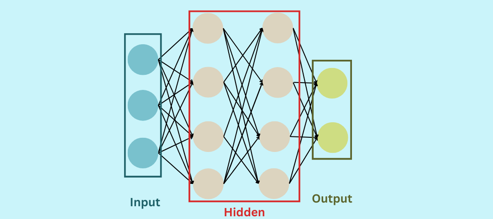

# ARTIFICIAL NEURAL NETWORK (ANN) IMPLEMENTED FROM SCRATCH :

**Author:** SALMA HAMDUN <br>
**Date:** 8/9/2025  <br>
**Version:** 1.0   <br>

______________________________________________________________________________________________________________

## PROJECT OVERVIEW : 
This project implements a **3-layer Artificial Neural Network (ANN) from scratch** using **NumPy**, without any high-level deep learning libraries. The network is designed for **binary classification tasks**,demonstrating:

- Forward propagation with ReLU and Sigmoid activations
- Backpropagation with L2 regularization
- Dropout for regularization
- Mini-batch gradient descent with early stopping
- Full training, validation, and testing workflow

______________________________________________________________________________________________________________

## PROJECT'S DEMO :
- Shows a simple run for the neural network.

[Click here to watch the full video](Assets/demo.mp4)

______________________________________________________________________________________________________________

## FEATURES : 
- Fully vectorized **forward and backward propagation**
- **ReLU** activation for hidden layers, **Sigmoid** for output
- **Dropout** in hidden layers for regularization
- **L2 regularization** to prevent overfitting
- **Mini-batch gradient descent** for efficient training
- **Early stopping** based on validation loss
- Metrics calculation: **Accuracy, Confusion Matrix**
- Visualization of **loss curves** and **accuracy bar charts**

______________________________________________________________________________________________________________

## REQUIRED LIBRARIES : 
```python
import pandas as pd   
import numpy as np 
from sklearn.preprocessing import StandardScaler, LabelEncoder , OneHotEncoder
from sklearn.compose import ColumnTransformer
from sklearn.pipeline import Pipeline
from sklearn.model_selection import train_test_split
import matplotlib.pyplot as plt
from sklearn.metrics import confusion_matrix 
import seaborn as sns
```

______________________________________________________________________________________________________________

## NETWORK ARCHITECTURE :
- **Input Layer:** Number of features in the dataset
- **Hidden Layer 1:** ReLU activation, configurable size
- **Hidden Layer 2:** ReLU activation, configurable size
- **Output Layer:** Sigmoid activation, single neuron for binary classification

**Example configuration:**
```python
input_size = X.SHAPE
hidden1_size = 8
hidden2_size = 4
output_size = 1
```

______________________________________________________________________________________________________________

## USAGE INSTRUCTIONS : 

### 1. INITIALISE DATA
```python
# Example: Load dataset and split
X_train, X_val, X_test = ...  # Preprocessed features
y_train, y_val, y_test = ...  # Labels
```

### 2. TRAIN THE MODEL 
```python
trained_params = model(
    X_train, y_train, X_val, y_val,
    input_size, hidden1_size, hidden2_size, output_size,
    epochs=2000, lr=0.2, lambd=0.01, keep_prob=0.9, batch_size=16, patience=100
)
```

### 3. MAKE PREDICTIONS 
```python
pred_train = predict(X_train, trained_params)
pred_val = predict(X_val, trained_params)
pred_test = predict(X_test, trained_params)
```

### 4. EVALUATE PERFORMANCE
```python
print(f"Training Accuracy: {accuracy(y_train, pred_train)*100:.2f}%")
print(f"Validation Accuracy: {accuracy(y_val, pred_val)*100:.2f}%")
print(f"Test Accuracy: {accuracy(y_test, pred_test)*100:.2f}%")
```

### 5. VISUALISE RESULTS
- **Loss Curve**
```python
plt.plot(loss_history, label="Validation Loss", color="red")
plt.xlabel("Epochs")
plt.ylabel("Loss")
plt.title("Loss Curve")
plt.legend()
plt.show()
```

- **Accuracy Bar Chart**
```python
train_acc = accuracy(y_train, pred_train) * 100
val_acc = accuracy(y_val, pred_val) * 100
test_acc = accuracy(y_test, pred_test) * 100

plt.bar(["Train", "Validation", "Test"], [train_acc, val_acc, test_acc], color=["green", "orange", "blue"])
plt.ylabel("Accuracy (%)")
plt.title("Model Accuracy")
plt.show()
```

- **Confusion Matrix**
```python
cm = confusion_matrix(y_test.flatten(), pred_test.flatten())
sns.heatmap(cm, annot=True, fmt="d", cmap="Blues",
            xticklabels=["Not Exited (0)", "Exited (1)"],
            yticklabels=["Not Exited (0)", "Exited (1)"])
plt.ylabel("Actual")
plt.xlabel("Predicted")
plt.title("Confusion Matrix - Test Set")
plt.show()
```

______________________________________________________________________________________________________________

## PERFORMANCE METRICS :
- Training, validation, and test **accuracy** are reported
- **Confusion matrix** visualizes model errors
- **Loss curve** shows convergence over epochs

______________________________________________________________________________________________________________

## KEY INSIGHTS :
- Dropout and L2 regularization **prevent overfitting**
- Mini-batch gradient descent improves **training efficiency**
- Early stopping ensures **optimal training without excessive epochs**
- ReLU activation avoids vanishing gradient issues in hidden layers

______________________________________________________________________________________________________________

## FUTURE IMPROVEMENTS :
- Implement **Adam or RMSProp** optimizers for faster convergence
- Add **multi-class classification** capability
- Extend to **deeper networks** with more hidden layers
- Add **GPU acceleration** for larger datasets

______________________________________________________________________________________________________________

## 📊EXPLORATORY DATA ANALYSIS (EDA) :
### 1. Target Distribution
- Shows the churn distribution ehich is the 'target' which is 'Exited': 1 or 'Not Exited' : 0


### 2. Numerical Features
- Shows all the numerical features in the dataset  

 

### 3. Numerical fatures vs Target 
- Shows all numerical features in plotted vs target as scatter 


### 4. HasCard & IsActiveMember features vs Target 
- Shows the two HasCard And IsActiveMember features vs the target "Exited"


### 5. Categorical features vs Target
- Shows all categorical features vs target

 

### 6. Each numerical feature vs Target
- Shows Each Numerical feature in front of Target 
 
 

### 7. Correlation Heatmap
- Shows the strength of correlation between all the data columns


______________________________________________________________________________________________________________

## MODEL VISUALISATION :
### 1. Neural Network Model :
- Shows approximate image of the neural network layers


### 2. Cofusion Matrix :
- Shows the number of correct and incorrect predictions for each class & gives insight about where the model performs well and where it makes mistakes.


### 3. Loss Curve :
- Shows how the model’s error decreases over epochs & indicates how well it's learning.


### 4. Accuracy :
- Shows the accuracy for each of Training , Validation & Testing Sets in the performance of the model.


______________________________________________________________________________________________________________

## FILE STRUCTURE :
```
neural_network_project/
├── main.ipynb          # Code + plan + visualisations 
│      
└── Assets/
   ├── Churn_Modelling.csv
   └── Categorical_features
   └── numerical_features

```

______________________________________________________________________________________________________________

## REFERENCES :
- Advanced Learning Algorithms (Stanford) 
- Kaggle
- GitHub
- NumPy and Matplotlib documentation
- Original backpropagation papers

